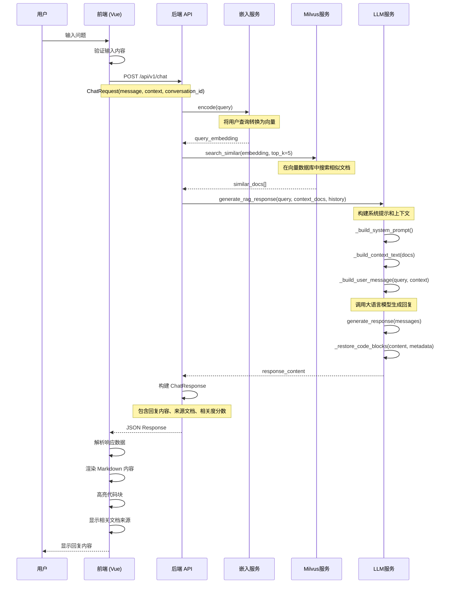
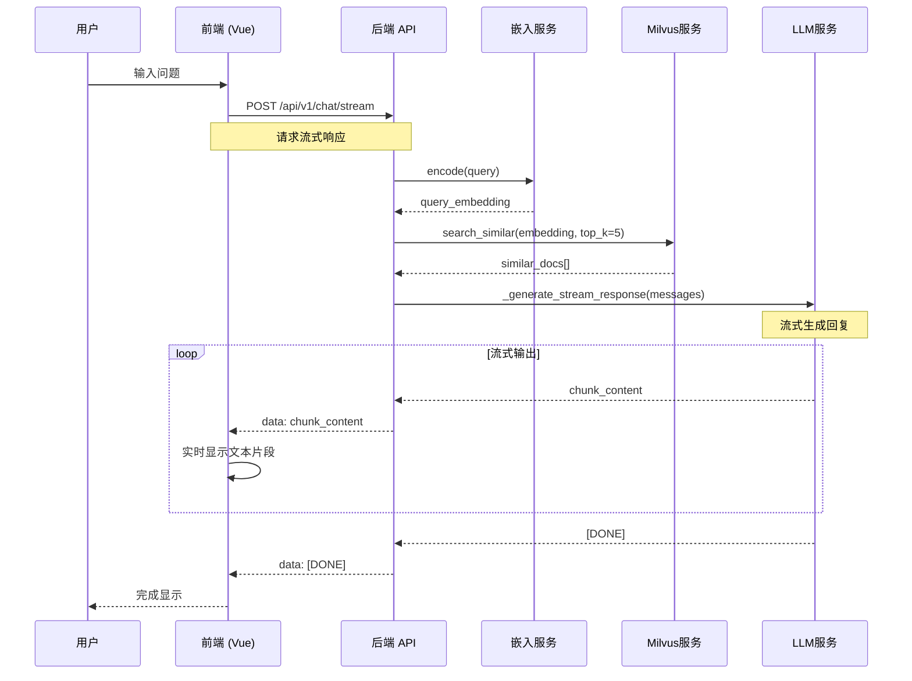

# K8s Assistant - Kubernetes 智能助手

一个基于 RAG (Retrieval-Augmented Generation) 技术的 Kubernetes 智能问答助手，能够基于官方文档为用户提供准确、专业的 K8s 相关回答。

## 🚀 项目概述

K8s Assistant 是一个全栈的智能问答系统，集成了大语言模型和向量数据库技术，专门为 Kubernetes 用户提供智能化的文档查询和问题解答服务。

## 📋 基本功能

### 1. 数据处理模块

#### 数据加载器 (`dataloader.py`)
- **功能**: 负责从 HTML 文档中加载和预处理数据
- **核心特性**:
  - 支持批量处理 HTML 文档
  - 自动过滤无效文件（如 `_print/index.html`）
  - 集成 Milvus 向量数据库
  - 利用ONNX加速嵌入模型(BAAI/bge-small-en-v1.5, zh版本在转换ONNX的时候出了点问题，所以用了en版)
  - 智能文档分块和向量化
  - 支持流式处理大量文档

#### 数据清理器 (`data_cleaner.py`)
- **功能**: 清理和验证处理后的数据，确保数据质量
- **核心特性**:
  - 文本内容清理和标准化
  - 元数据验证和修复
  - 节点有效性检查
  - 代码块提取和关联
  - HTML 内容预处理
  - 数据类型安全转换

#### 代码提取器 (`code_extractor.py`)
- **功能**: 从 HTML 文档中智能提取代码块
- **核心特性**:
  - 代码块位置信息记录
  - 代码内容完整性保护
  - 代码块与文档节点智能关联

### 2. 后端服务

#### API 服务
- **框架**: FastAPI + Uvicorn
- **核心功能**:
  - RESTful API 接口
  - 流式聊天响应
  - 对话历史管理
  - 健康检查端点
  - CORS 跨域支持
  - 自动 API 文档生成

#### 核心服务模块
- **LLM 服务** (`llm_service.py`): 大语言模型集成，支持 OpenAI 兼容接口
- **嵌入服务** (`embedding_service.py`): 文本向量化处理
- **Milvus 服务** (`milvus_service.py`): 向量数据库操作

#### 数据处理流程
1. **文档加载**: 从指定目录加载 HTML 文档
2. **内容提取**: 使用 BeautifulSoup 解析 HTML 内容
3. **代码提取**: 智能提取并保护代码块
4. **文本清理**: 移除无关标签，保留核心内容
5. **文档分块**: 按配置大小分割文档
6. **向量化**: 生成文档嵌入向量
7. **索引构建**: 在 Milvus 中建立向量索引

### 3. 前端界面

#### 技术栈
- **框架**: Vue 3 + TypeScript
- **构建工具**: Vite

#### 核心功能
- **聊天界面**: 现代化的对话界面

## 🛠️ 技术栈

### 后端技术
- **Web 框架**: FastAPI 0.104.1
- **ASGI 服务器**: Uvicorn 0.24.0
- **向量数据库**: Milvus 2.6.1 + Milvus Lite 2.5.1
- **大语言模型**: OpenAI API (兼容接口)
- **嵌入模型**: 
  - HuggingFace Transformers 4.56.1
  - Sentence Transformers 4.1.0
  - ONNX Runtime GPU 1.19.0
- **文档处理**: 
  - BeautifulSoup4 4.13.5
  - html2text 2025.4.15
  - LlamaIndex 0.13.4

### 前端技术
- **核心框架**: Vue 3.3.8
- **开发语言**: TypeScript 5.2.0
- **构建工具**: Vite 5.0.0
- **路由管理**: Vue Router 4.2.5

### 部署和运维
- **容器化**: Docker + Docker Compose
- **反向代理**: Nginx
- **进程管理**: 支持原生部署和容器部署
- **日志系统**: Loguru 0.7.2
- **配置管理**: python-dotenv 1.1.1

## 🔄 用户消息处理流程

当用户发送消息时，系统按以下序列图进行函数调用处理：



### 详细处理步骤

1. **用户输入阶段**
   - 用户在前端界面输入问题
   - 前端验证输入内容
   - 构建聊天请求对象

2. **请求传输阶段**
   - 通过 Axios 发送 POST 请求到 `/api/v1/chat`
   - 请求包含用户消息、对话历史、配置参数

3. **后端处理阶段**
   - **查询向量化**: 使用嵌入模型将用户查询转换为向量
   - **相似性搜索**: 在 Milvus 向量数据库中搜索最相关的文档片段
   - **上下文构建**: 整合检索到的文档和对话历史
   - **LLM 生成**: 使用大语言模型基于上下文生成回答
   - **代码恢复**: 将提取的代码块重新整合到回复中

4. **响应返回阶段**
   - 构建包含回复内容、来源文档、相关度分数的响应
   - 返回 JSON 格式的聊天响应
   - 包含消息ID、时间戳、对话ID等元信息

5. **前端展示阶段**
   - 接收并解析响应数据
   - 使用 Markdown 渲染器格式化内容
   - 高亮显示代码块
   - 展示相关文档来源
   - 更新对话历史

### 流式响应支持

系统还支持流式响应模式，使用 Server-Sent Events (SSE) 技术：



**流式响应特点**：
- 用户可选择流式输出获得实时响应
- 后端使用 Server-Sent Events (SSE) 技术
- 前端实时接收和显示生成的文本片段
- 提供更好的用户体验，特别是对于长回答

## 📁 项目结构

```
k8sassistant/
├── backend/                 # 后端服务
│   ├── app/
│   │   ├── api/            # API 路由
│   │   ├── core/           # 核心配置
│   │   ├── models/         # 数据模型
│   │   └── services/       # 业务服务
│   ├── main.py            # 应用入口
│   └── requirements.txt   # Python 依赖
├── frontend/              # 前端应用
│   ├── src/
│   │   ├── api/          # API 接口
│   │   ├── components/   # Vue 组件
│   │   ├── views/        # 页面视图
│   │   └── stores/       # 状态管理
│   └── package.json      # Node.js 依赖
├── data_processing/       # 数据处理模块
│   ├── processors/       # 数据处理器
│   └── crawlers/         # 数据爬虫
├── docker/               # Docker 配置
├── deploy/               # 部署脚本
└── docs/                 # 项目文档
```

## 🚀 快速开始

### 环境要求
- Python 3.8+
- Node.js 16+
- Docker (可选)

### 安装和运行

1. **克隆项目**
```bash
git clone <repository-url>
cd k8sassistant
```

2. **后端启动**
```bash
cd backend
pip install -r requirements.txt
python main.py
```

3. **前端启动**
```bash
cd frontend
npm install
npm run dev
```

4. **数据处理**
```bash
cd data_processing/processors
python dataloader.py --data-dir /path/to/html/docs --start-milvus
```

### 配置说明

创建 `.env` 文件配置环境变量：
```env
# LLM 配置
LLM_API_KEY=your_api_key
LLM_BASE_URL=https://api.openai.com/v1
LLM_MODEL=gpt-3.5-turbo

# 嵌入模型配置
EMBEDDING_MODEL=BAAI/bge-small-en-v1.5
EMBEDDING_DEVICE=cpu
EMBEDDING_BACKEND=torch

# 数据库配置
MILVUS_URI=http://localhost:19530
COLLECTION_NAME=k8s_docs
```

## 📖 使用说明

1. **数据准备**: 将 Kubernetes 官方文档的 HTML 文件放入指定目录
2. **数据预处理**: 运行数据处理脚本建立向量索引
3. **启动服务**: 启动后端和前端服务
4. **开始对话**: 在 Web 界面中输入 K8s 相关问题
5. **查看结果**: 系统会基于官方文档提供准确的回答

## 🤝 贡献指南

欢迎提交 Issue 和 Pull Request 来改进项目。

## 📄 许可证

本项目采用 MIT 许可证。

---

**注意**: 本项目专门针对 Kubernetes 文档进行优化，确保回答的准确性和专业性。系统严格基于提供的文档内容进行回答，不会使用训练数据中的过时信息。
